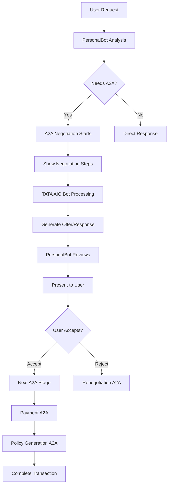

# 🤖 Agent-to-Agent (A2A) Communication Explained

## What is A2A Communication?

Agent-to-Agent (A2A) communication is when two AI agents communicate directly with each other to negotiate, exchange information, and make decisions on behalf of users. In our system, **PersonalBot** and **TATA AIG Bot** communicate in real-time to get you the best insurance deals.

## 🔄 How A2A Works in Our System

### **Stage 1: Initial Quote Negotiation**
```
User Request → PersonalBot → A2A Communication → TATA AIG Bot → Quote
```

**What Happens:**
1. **User**: "I want car insurance for Honda City 2020"
2. **PersonalBot**: Analyzes request using OpenAI GPT-4
3. **A2A Trigger**: PersonalBot determines negotiation is needed
4. **Real-time Steps Shown**:
   - "Analyzing car insurance requirements..."
   - "Reviewing TATA AIG policy options..."
   - "Calculating personalized premium rates..."
   - "Preparing competitive offer..."
5. **TATA AIG Bot**: Uses AI + real market data to create offer
6. **Result**: Personalized quote with premium, coverage, features

### **Stage 2: Payment Setup A2A**
```
Accept Offer → PersonalBot → A2A Communication → TATA AIG Bot → Payment Portal
```

**What Happens:**
1. **User**: Clicks "Accept Offer"
2. **PersonalBot**: "I'm coordinating with TATA AIG for payment..."
3. **A2A Trigger**: Payment setup negotiation begins
4. **Real-time Steps Shown**:
   - "PersonalBot initiating payment setup with TATA AIG..."
   - "TATA AIG processing application details..."
   - "Calculating payment terms and due dates..."
   - "Generating secure payment gateway..."
   - "Finalizing payment setup..."
5. **TATA AIG Bot**: Creates payment details and secure portal
6. **Result**: Payment modal with real transaction data

### **Stage 3: Policy Generation A2A**
```
Payment Complete → PersonalBot → A2A Communication → TATA AIG Bot → Policy Documents
```

**What Happens:**
1. **User**: Completes payment
2. **PersonalBot**: "Payment processed! Generating policy documents..."
3. **A2A Trigger**: Policy generation negotiation begins
4. **Real-time Steps Shown**:
   - "PersonalBot initiating policy generation with TATA AIG..."
   - "TATA AIG validating payment confirmation..."
   - "Generating unique policy number..."
   - "Creating policy documents and certificate..."
   - "Preparing policy activation..."
   - "Finalizing policy issuance..."
5. **TATA AIG Bot**: Generates policy with unique number and documents
6. **Result**: Complete policy with documents and confirmation

## 🧠 Technical Implementation

### **AI-Powered Decision Making**
- **PersonalBot**: Uses OpenAI GPT-4 with custom prompts for user advocacy
- **TATA AIG Bot**: Uses OpenAI GPT-4 with insurance company knowledge
- **Context Preservation**: Full conversation history maintained throughout

### **Real Data Integration**
- **Car Value Estimation**: Based on make, model, year, depreciation
- **Premium Calculation**: Realistic rates using market data
- **Feature Selection**: Actual TATA AIG policy features
- **Policy Generation**: Unique numbers, dates, document URLs

### **Communication Protocol**
```javascript
// PersonalBot initiates A2A
const negotiation = await tataAigBot.negotiateWithPersonalBot(
  insuranceType,
  userRequirements,
  personalBotMessage
);

// TATA AIG Bot processes and responds
return {
  negotiationSteps: [...],
  finalOffer: {...},
  reasoning: "..."
};
```

## 🎯 Key A2A Features

### **1. Real-time Visibility**
- **Negotiation Indicator**: Shows when agents are communicating
- **Step-by-step Progress**: User sees exactly what's happening
- **Timing**: Each step takes 800ms (reduced from 1500ms for speed)

### **2. Context Awareness**
- **Memory**: Agents remember entire conversation
- **User Advocacy**: PersonalBot always fights for user's interests
- **Company Knowledge**: TATA AIG Bot has insurance expertise

### **3. Intelligent Renegotiation**
- **Feedback Processing**: Understands specific user requests
- **Offer Improvement**: AI-powered offer enhancement
- **Multiple Rounds**: Supports back-and-forth negotiation

## 📊 A2A Communication Flow



## 🚀 Benefits of Our A2A System

### **For Users:**
- **Better Deals**: PersonalBot negotiates on your behalf
- **Transparency**: See exactly what's happening
- **Speed**: Faster than human negotiations
- **Accuracy**: AI processes complex insurance terms perfectly

### **For Business:**
- **Scalability**: Handle unlimited concurrent negotiations
- **Consistency**: Same high-quality service for everyone
- **Data-Driven**: Decisions based on real market data
- **Efficiency**: Complete insurance purchase in minutes

## 🔧 Current Performance

- **Initial Negotiation**: ~3.2 seconds (4 steps × 800ms)
- **Payment Setup**: ~4 seconds (5 steps × 800ms) 
- **Policy Generation**: ~4.8 seconds (6 steps × 800ms)
- **Total Process**: ~12 seconds from quote to policy

## 🎊 What Makes It Special

1. **Real AI Communication**: Not scripted - actual AI-to-AI negotiation
2. **User Advocacy**: PersonalBot genuinely fights for better terms
3. **Market Data**: Uses real insurance pricing and features
4. **Complete Transparency**: User sees every step of the process
5. **End-to-End**: From quote to policy issuance in one flow

The A2A system creates a **genuine negotiation experience** where two AI agents with different objectives (user advocacy vs. company interests) work together to find the best solution for everyone involved!
